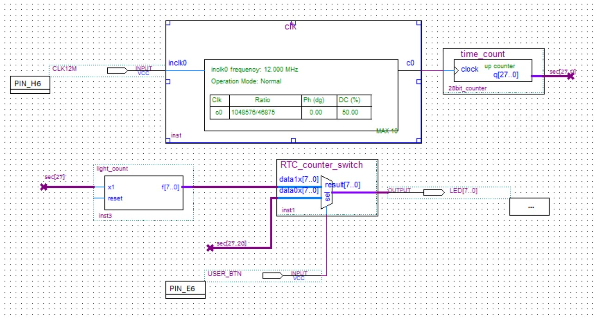

# MAX1000 RTC

An RTC based on a "268.435456 MHz" clock. The LEDs represent the seconds passed by default, but can display the top eight bits of the 28bit counter when the USER_BTN is held.

Note: The actual clock out of the PLL is 268.500000 MHz which is +240.44 ppm off of 268.435456 MHz. This will lose about 21 seconds/day in accuracy.

## Getting Started
### Instructions

1. Open the project (.pqb)
2. Open *Tools -> TCL Scripts...*.
3. Run the *RTC.tcl* script

### Prerequisites

What things you need to install the software and how to install them

[Quartus](https://www.intel.com/content/www/us/en/software/programmable/quartus-prime/download.html)  
[MAX1000](https://www.arrow.com/en/products/max1000/arrow-development-tools)  
[Arrow USB Blaster](https://www.arrow.com/en/products/max1000/arrow-development-tools/-/media/e0151a61f1d844378206d2db77f3f259.ashx?h=16&thn=1&w=16)

## Authors

* **Ryan Thompson** - *Initial work* - [PurpleBooth](https://github.com/rthomp10)

See also the list of [contributors](https://github.com/your/project/contributors) who participated in this project.

## License

This project is licensed under the MIT License - see the [LICENSE.md](LICENSE.md) file for details

